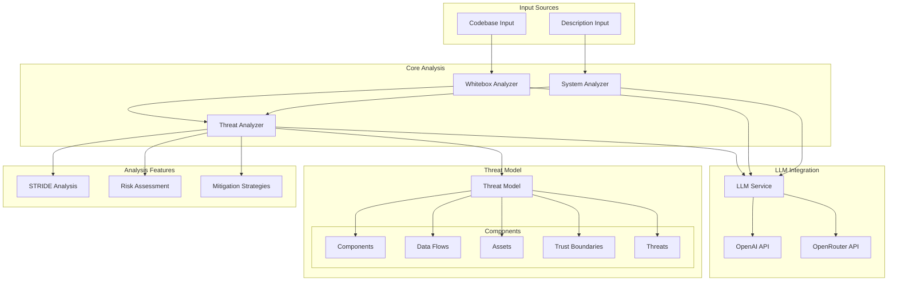

 AI Agent for Threat Modeling

AI-driven threat modeling tool that helps identify and analyze security threats in your application architecture following the STRIDE methodology.
## Features

- **AI-Powered Analysis**: Leverages advanced language models to analyze application descriptions and codebases
- **Interactive Visualization**: Dynamic network graph showing components, data flows, and trust boundaries
- **Comprehensive Threat Detection**: Identifies potential security vulnerabilities using STRIDE methodology
- **Multiple Analysis Modes**:
  - Description-based analysis
  - Codebase analysis (whitebox)
- **Detailed Threat Reports**: Includes risk levels, mitigations, and affected components

## Project Architecture



## Prerequisites

- Python 3.8 or higher
- API key from either OpenAI or OpenRouter

## Installation

1. Clone the repository:

cd arrows

2. Install dependencies:

pip install -r requirements.txt


3. Set up environment variables in .env file :

# exact URL your sample uses
OLLAMA_API_URL=
# or, alternatively:
# OLLAMA_API_BASE=""

OLLAMA_API_KEY=
OLLAMA_MODEL=

DEFAULT_MODEL=
# Increase if the gateway is slow
LLM_TIMEOUT_S=300
# Try more attempts before failing
LLM_MAX_RETRIES=4
# Enable/disable automatic fallback to faster models
LLM_USE_FALLBACK=true
# Backoff growth
LLM_BACKOFF_BASE=2.0

## Usage

### Web Interface

1. Start the web server:
```bash
python app.py
```

2. Open your browser and navigate to `http://localhost:5000`

3. Choose your analysis method:
   - **Description Analysis**: Provide a detailed description of your application, an example is in examples/application.txt
   - **Codebase Analysis**: Upload a ZIP file containing your application code, an example is in examples/react-app/ that needs to be zipped

4. Select your preferred LLM model for analysis (gpt-oss is the fatest, llama is the best but also the most expensive)

5. View the interactive visualization and threat analysis results


